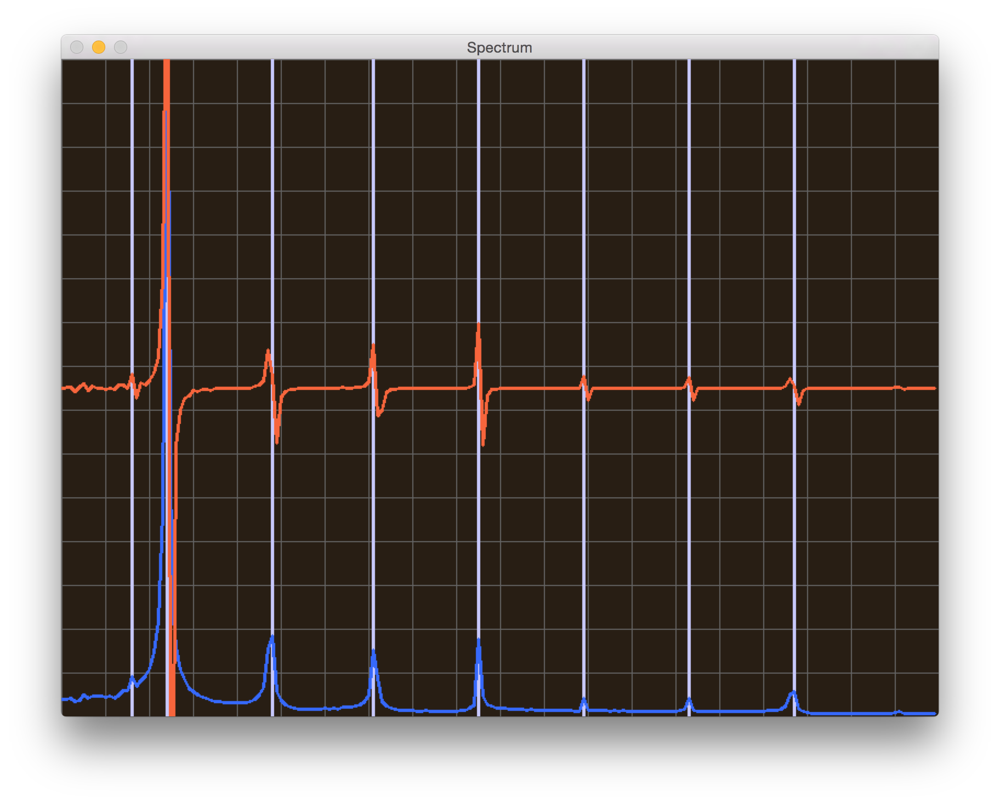

## Sound

This little application samples and visualizes the input from the sound card.
It also shows the spectrum of the incoming signal and displays the frequency of the maximum span.

### Dependencies
You need the following libraries:
- OpenCV to visualize the sound input and spectrum
- OpenAL to access the sound card
- FFTW to apply fourrier transformations
